# Secure Components - Mermaid Output

**Authors:** Wolf McNally, Christopher Allen, Blockchain Commons</br>
**Revised:** Oct 18, 2022</br>
**Status:** DRAFT

---

## Contents

* [Envelope Introduction](00-INTRODUCTION.md)
* [Types](01-TYPES.md)
* [Envelope Overview](02-ENVELOPE.md)
* [Envelope Notation](03-ENVELOPE-NOTATION.md)
* Mermaid Output: This document
* [Envelope Expressions](05-ENVELOPE-EXPRESSIONS.md)
* [Definitions](06-DEFINITIONS.md)
* [Examples](07-EXAMPLES.md)
* [Noncorrelation](08-NONCORRELATION.md)
* [Elision and Redaction](09-ELISION-REDACTION.md)
* [Existence Proofs](10-EXISTENCE-PROOFS.md)
* [Appendix A: MVA Algorithm Suite](11-A-ALGORITHMS.md)
* [Appendix B: Envelope Test Vectors](12-B-ENVELOPE-TEST-VECTORS.md)
* [Appendix C: Envelope SSKR Test Vectors](13-C-ENVELOPE-SSKR-TEST-VECTORS.md)

---

## Introduction

These examples compare a series of Gordian Envelopes output first in "envelope notation" and then in [Mermaid](https://mermaid-js.github.io/mermaid/#/) format.

## Plaintext

```
"Hello."
```

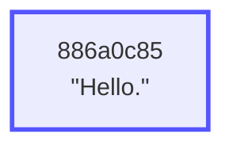

* Leaf elements (elements having no children) have blue outlines.
* CBOR leaf elements (like strings, but they can be of any complexity) are represented by rectangles.
* The digests shown in each element are the first four bytes of the 32-byte digest associated with each element.
* Every element you see is *itself* an envelope that can be extracted and manipulated. If two digests match, the contents of the envelopes they represent also necessarily match.

## Signed Plaintext

```
"Hello." [
    verifiedBy: Signature
]
```

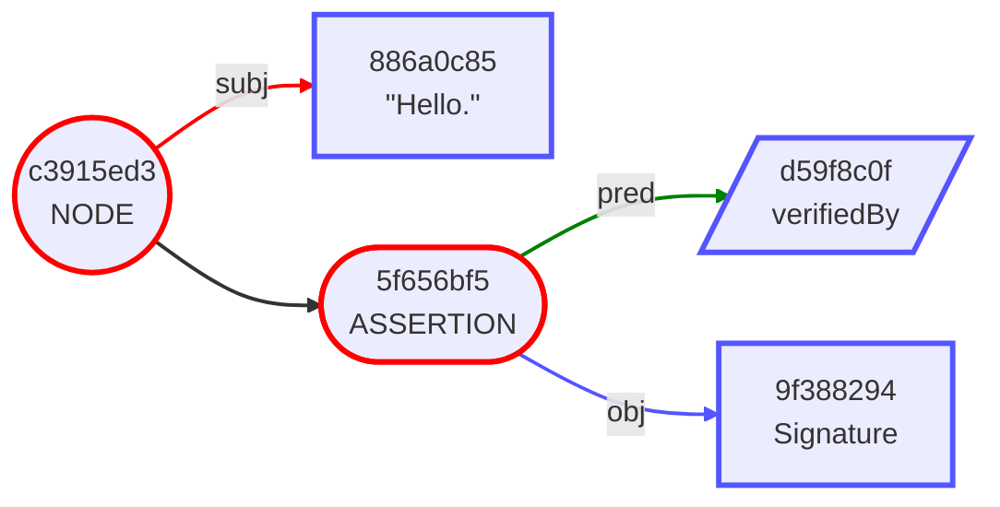

* Internal elements (elements with children) are represented with red outlines.
* A `NODE` element appears when one or more assertions are present on a subject. They are represented by circles. They have one arm for the `subject` and an additional arm for each assertion.
* An `ASSERTION` element is represented by the Mermaid `stadium`  shape, and has exactly two arms: `predicate` and `object`.
* Well-known values like the `verifiedBy` are represented by trapezoids, and are encoded as short integers.

## Encrypted Subject

```
ENCRYPTED [
    "knows": "Bob"
]
```

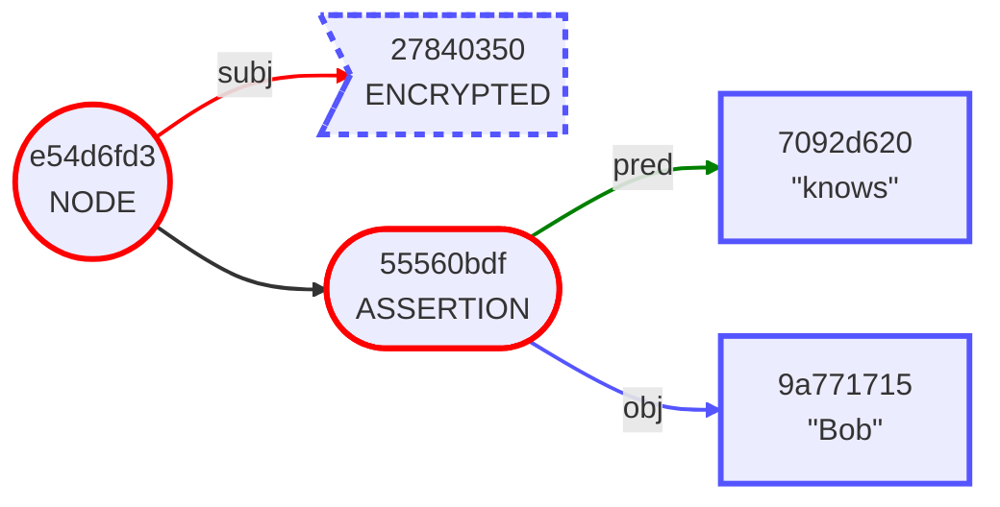

* `ENCRYPTED` and `ELIDED` elements appear with dotted outlines in the Mermaid output, to indicate that they may be replaced with their unencrypted/unelided counterparts without invalidating the digest tree.
* `ENCRYPTED` elements are represented by the Mermaid `asymmetric` shape.

## Elided Object

```
"Alice" [
    "knows": ELIDED
]
```

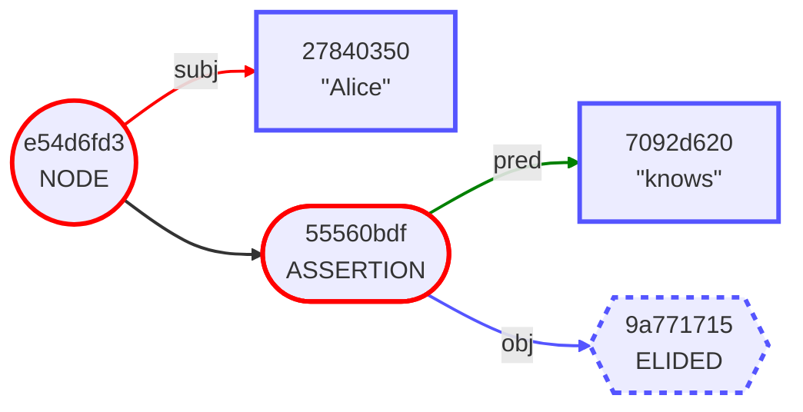

* `ELIDED` elements are represented by dotted hexagons.
* Note that the digest of the element "Bob" in the previous example matches the digest of the elided element above.
* Likewise, note that the digest of the subject "Alice" matches the encrypted version in the previous example.
* In fact, *all* the digests in this envelope match those in the previous example, indicating that the unencrypted/unelided form of this envelope has the exact same content.

## Top-Level Assertion

```
"knows": "Bob"
```

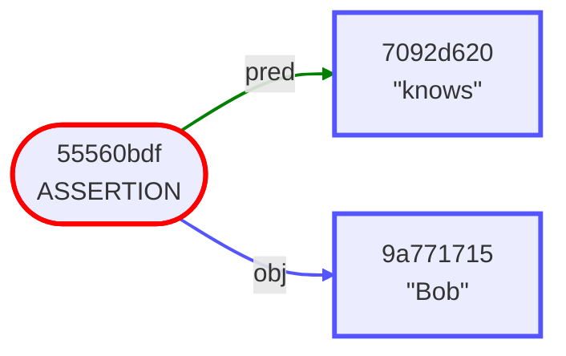

* As mentioned previously, all of the element types are themselves envelopes, and can therefore stand alone. In this case, we have extracted a single assertion.


## Signed Subject

```
"Alice" [
    "knows": "Bob"
    "knows": "Carol"
    verifiedBy: Signature
]
```

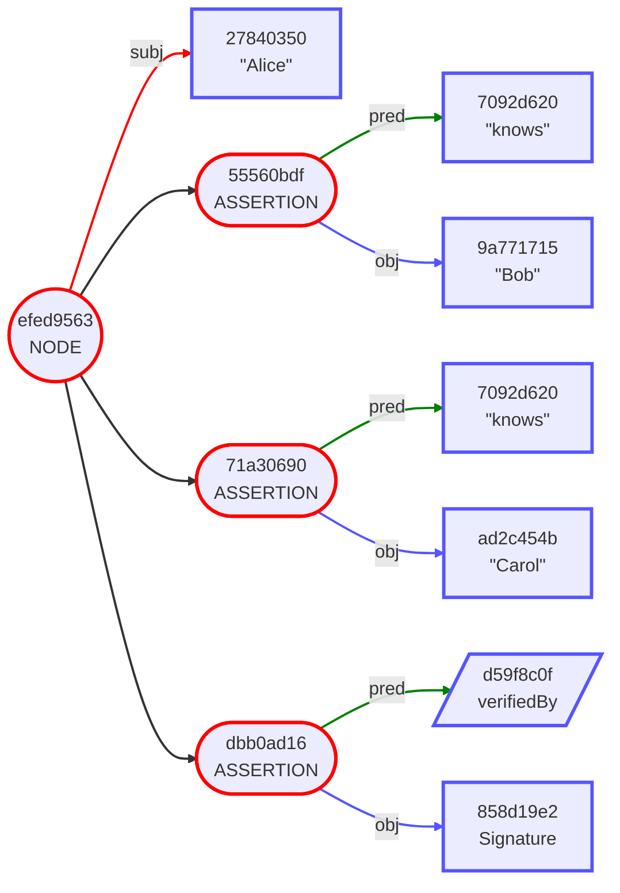

* A signature signs only the digest of the subject, in this case "Alice". So in this case, the "knows" assertions are not signed.
* Note that for every internal element, the children are displayed in the order that their digests are combined to form the parent's digest. In particular a `NODE`'s, `ASSERTION` elements are ordered by ascending digest value, so the order of the three assertion digests here: `3ed95464`, `55560bdf`, `71a30690` reflects that ascending order.

## Elided Assertions

```
"Alice" [
    ELIDED (3)
]
```

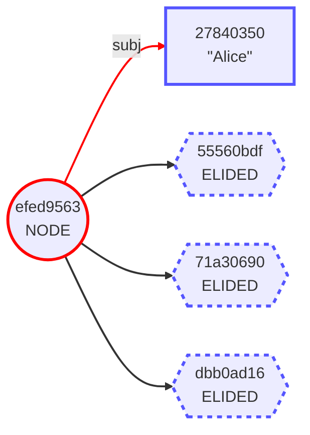

* This is the same envelope from the previous example with its assertions elided. Note that the digests at every level still present are all the same.

## Wrapped Then Signed

```
{
    "Alice" [
        "knows": "Bob"
        "knows": "Carol"
    ]
} [
    verifiedBy: Signature
]
```

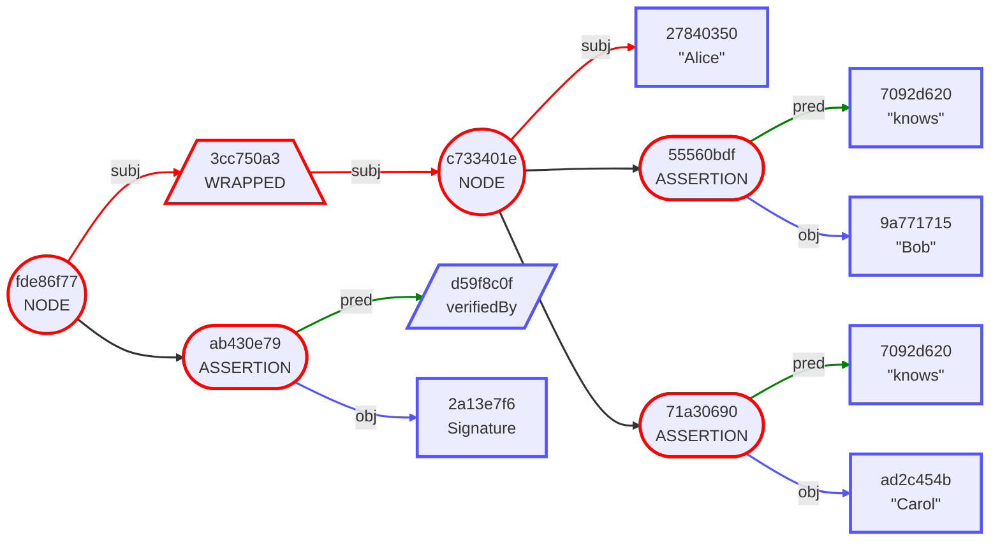

* In this case the signature still only signs the subject, but the subject is an entire envelope that's been wrapped.
* `WRAPPED` elements are represented by trapezoids. They have exactly one arm, which is the root of the wrapped envelope.

## Encrypt to Recipients

```
ENCRYPTED [
    hasRecipient: SealedMessage
    hasRecipient: SealedMessage
]
```

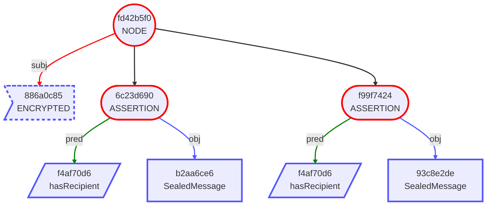

* Top-to-bottom layout is also supported.

## Complex Metadata

```
Digest(e8aa201d) [
    "format": "EPUB"
    "work": CID(7fb90a9d) [
        "author": CID(9c747ace) [
            dereferenceVia: "LibraryOfCongress"
            hasName: "Ayn Rand"
        ]
        "isbn": "9780451191144"
        dereferenceVia: "LibraryOfCongress"
        hasName: "Atlas Shrugged" [
            language: "en"
        ]
        hasName: "La rebelión de Atlas" [
            language: "es"
        ]
        isA: "novel"
    ]
    dereferenceVia: "IPFS"
]
```

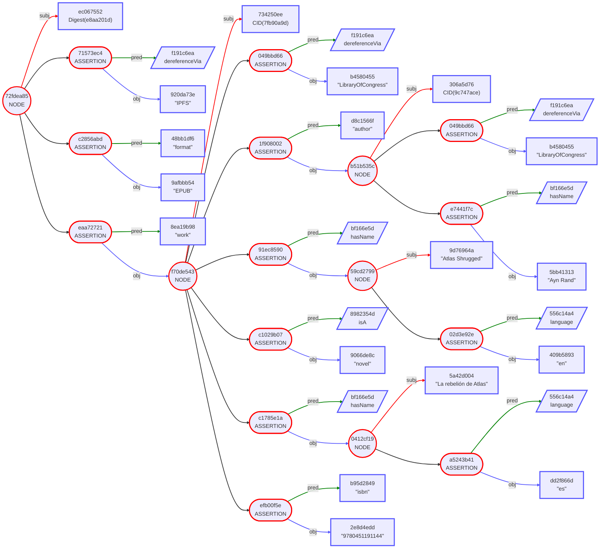

## Verifiable Credential

```
{
    CID(4676635a) [
        "certificateNumber": "123-456-789"
        "continuingEducationUnits": 1.5
        "expirationDate": 2028-01-01
        "firstName": "James"
        "issueDate": 2020-01-01
        "lastName": "Maxwell"
        "photo": "This is James Maxwell's photo."
        "professionalDevelopmentHours": 15
        "subject": "RF and Microwave Engineering"
        "topics": CBOR
        controller: "Example Electrical Engineering Board"
        isA: "Certificate of Completion"
        issuer: "Example Electrical Engineering Board"
    ]
} [
    note: "Signed by Example Electrical Engineering Board"
    verifiedBy: Signature
]
```

```mermaid
graph LR
    1(("6b879639<br/>NODE"))
    2[/"dbd70e79<br/>WRAPPED"\]
    3(("b750a45f<br/>NODE"))
    4["bdd347d4<br/>CID(4676635a)"]
    5(["0536afd8<br/>ASSERTION"])
    6["a791d0c7<br/>#quot;photo#quot;"]
    7["9e77bb70<br/>#quot;This is James Maxwell's photo.#quot;"]
    8(["1d598c65<br/>ASSERTION"])
    9["eb62836d<br/>#quot;lastName#quot;"]
    10["997a0e2d<br/>#quot;Maxwell#quot;"]
    11(["34f8f7d3<br/>ASSERTION"])
    12["b1e12d58<br/>#quot;issueDate#quot;"]
    13["2511c0df<br/>2020-01-01"]
    14(["3d00d64f<br/>ASSERTION"])
    15[/"2f9bee2f<br/>controller"/]
    16["4035b4bd<br/>#quot;Example Electrical Engineering Board#quot;"]
    17(["44736993<br/>ASSERTION"])
    18["05651934<br/>#quot;topics#quot;"]
    19["264aec65<br/>CBOR"]
    20(["46d6cfea<br/>ASSERTION"])
    21[/"8982354d<br/>isA"/]
    22["112e2cdb<br/>#quot;Certificate of Completion#quot;"]
    23(["4a69fca3<br/>ASSERTION"])
    24["b6d5ea01<br/>#quot;continuingEducationUnits#quot;"]
    25["02a61366<br/>1.5"]
    26(["5545f6e2<br/>ASSERTION"])
    27[/"954c8356<br/>issuer"/]
    28["4035b4bd<br/>#quot;Example Electrical Engineering Board#quot;"]
    29(["61689bb7<br/>ASSERTION"])
    30["e6c2932d<br/>#quot;expirationDate#quot;"]
    31["b91eea18<br/>2028-01-01"]
    32(["a0274d1c<br/>ASSERTION"])
    33["62c0a26e<br/>#quot;certificateNumber#quot;"]
    34["ac0b465a<br/>#quot;123-456-789#quot;"]
    35(["d4f678a9<br/>ASSERTION"])
    36["c4d5323d<br/>#quot;firstName#quot;"]
    37["bfe9d39b<br/>#quot;James#quot;"]
    38(["e0070876<br/>ASSERTION"])
    39["0eb38394<br/>#quot;subject#quot;"]
    40["b059b0f2<br/>#quot;RF and Microwave Engineering#quot;"]
    41(["e96b24d9<br/>ASSERTION"])
    42["c8c1a6dd<br/>#quot;professionalDevelopmentHours#quot;"]
    43["0bf6b955<br/>15"]
    44(["42fd806a<br/>ASSERTION"])
    45[/"d59f8c0f<br/>verifiedBy"/]
    46["dcfa430e<br/>Signature"]
    47(["afe231cc<br/>ASSERTION"])
    48[/"61fb6a6b<br/>note"/]
    49["f4bf011f<br/>#quot;Signed by Example Electrical Engineering Board#quot;"]
    1 -->|subj| 2
    2 -->|subj| 3
    3 -->|subj| 4
    3 --> 5
    5 -->|pred| 6
    5 -->|obj| 7
    3 --> 8
    8 -->|pred| 9
    8 -->|obj| 10
    3 --> 11
    11 -->|pred| 12
    11 -->|obj| 13
    3 --> 14
    14 -->|pred| 15
    14 -->|obj| 16
    3 --> 17
    17 -->|pred| 18
    17 -->|obj| 19
    3 --> 20
    20 -->|pred| 21
    20 -->|obj| 22
    3 --> 23
    23 -->|pred| 24
    23 -->|obj| 25
    3 --> 26
    26 -->|pred| 27
    26 -->|obj| 28
    3 --> 29
    29 -->|pred| 30
    29 -->|obj| 31
    3 --> 32
    32 -->|pred| 33
    32 -->|obj| 34
    3 --> 35
    35 -->|pred| 36
    35 -->|obj| 37
    3 --> 38
    38 -->|pred| 39
    38 -->|obj| 40
    3 --> 41
    41 -->|pred| 42
    41 -->|obj| 43
    1 --> 44
    44 -->|pred| 45
    44 -->|obj| 46
    1 --> 47
    47 -->|pred| 48
    47 -->|obj| 49
    style 1 stroke:red,stroke-width:3.0px
    style 2 stroke:red,stroke-width:3.0px
    style 3 stroke:red,stroke-width:3.0px
    style 4 stroke:#55f,stroke-width:3.0px
    style 5 stroke:red,stroke-width:3.0px
    style 6 stroke:#55f,stroke-width:3.0px
    style 7 stroke:#55f,stroke-width:3.0px
    style 8 stroke:red,stroke-width:3.0px
    style 9 stroke:#55f,stroke-width:3.0px
    style 10 stroke:#55f,stroke-width:3.0px
    style 11 stroke:red,stroke-width:3.0px
    style 12 stroke:#55f,stroke-width:3.0px
    style 13 stroke:#55f,stroke-width:3.0px
    style 14 stroke:red,stroke-width:3.0px
    style 15 stroke:#55f,stroke-width:3.0px
    style 16 stroke:#55f,stroke-width:3.0px
    style 17 stroke:red,stroke-width:3.0px
    style 18 stroke:#55f,stroke-width:3.0px
    style 19 stroke:#55f,stroke-width:3.0px
    style 20 stroke:red,stroke-width:3.0px
    style 21 stroke:#55f,stroke-width:3.0px
    style 22 stroke:#55f,stroke-width:3.0px
    style 23 stroke:red,stroke-width:3.0px
    style 24 stroke:#55f,stroke-width:3.0px
    style 25 stroke:#55f,stroke-width:3.0px
    style 26 stroke:red,stroke-width:3.0px
    style 27 stroke:#55f,stroke-width:3.0px
    style 28 stroke:#55f,stroke-width:3.0px
    style 29 stroke:red,stroke-width:3.0px
    style 30 stroke:#55f,stroke-width:3.0px
    style 31 stroke:#55f,stroke-width:3.0px
    style 32 stroke:red,stroke-width:3.0px
    style 33 stroke:#55f,stroke-width:3.0px
    style 34 stroke:#55f,stroke-width:3.0px
    style 35 stroke:red,stroke-width:3.0px
    style 36 stroke:#55f,stroke-width:3.0px
    style 37 stroke:#55f,stroke-width:3.0px
    style 38 stroke:red,stroke-width:3.0px
    style 39 stroke:#55f,stroke-width:3.0px
    style 40 stroke:#55f,stroke-width:3.0px
    style 41 stroke:red,stroke-width:3.0px
    style 42 stroke:#55f,stroke-width:3.0px
    style 43 stroke:#55f,stroke-width:3.0px
    style 44 stroke:red,stroke-width:3.0px
    style 45 stroke:#55f,stroke-width:3.0px
    style 46 stroke:#55f,stroke-width:3.0px
    style 47 stroke:red,stroke-width:3.0px
    style 48 stroke:#55f,stroke-width:3.0px
    style 49 stroke:#55f,stroke-width:3.0px
    linkStyle 0 stroke:red,stroke-width:2.0px
    linkStyle 1 stroke:red,stroke-width:2.0px
    linkStyle 2 stroke:red,stroke-width:2.0px
    linkStyle 3 stroke-width:2.0px
    linkStyle 4 stroke:green,stroke-width:2.0px
    linkStyle 5 stroke:#55f,stroke-width:2.0px
    linkStyle 6 stroke-width:2.0px
    linkStyle 7 stroke:green,stroke-width:2.0px
    linkStyle 8 stroke:#55f,stroke-width:2.0px
    linkStyle 9 stroke-width:2.0px
    linkStyle 10 stroke:green,stroke-width:2.0px
    linkStyle 11 stroke:#55f,stroke-width:2.0px
    linkStyle 12 stroke-width:2.0px
    linkStyle 13 stroke:green,stroke-width:2.0px
    linkStyle 14 stroke:#55f,stroke-width:2.0px
    linkStyle 15 stroke-width:2.0px
    linkStyle 16 stroke:green,stroke-width:2.0px
    linkStyle 17 stroke:#55f,stroke-width:2.0px
    linkStyle 18 stroke-width:2.0px
    linkStyle 19 stroke:green,stroke-width:2.0px
    linkStyle 20 stroke:#55f,stroke-width:2.0px
    linkStyle 21 stroke-width:2.0px
    linkStyle 22 stroke:green,stroke-width:2.0px
    linkStyle 23 stroke:#55f,stroke-width:2.0px
    linkStyle 24 stroke-width:2.0px
    linkStyle 25 stroke:green,stroke-width:2.0px
    linkStyle 26 stroke:#55f,stroke-width:2.0px
    linkStyle 27 stroke-width:2.0px
    linkStyle 28 stroke:green,stroke-width:2.0px
    linkStyle 29 stroke:#55f,stroke-width:2.0px
    linkStyle 30 stroke-width:2.0px
    linkStyle 31 stroke:green,stroke-width:2.0px
    linkStyle 32 stroke:#55f,stroke-width:2.0px
    linkStyle 33 stroke-width:2.0px
    linkStyle 34 stroke:green,stroke-width:2.0px
    linkStyle 35 stroke:#55f,stroke-width:2.0px
    linkStyle 36 stroke-width:2.0px
    linkStyle 37 stroke:green,stroke-width:2.0px
    linkStyle 38 stroke:#55f,stroke-width:2.0px
    linkStyle 39 stroke-width:2.0px
    linkStyle 40 stroke:green,stroke-width:2.0px
    linkStyle 41 stroke:#55f,stroke-width:2.0px
    linkStyle 42 stroke-width:2.0px
    linkStyle 43 stroke:green,stroke-width:2.0px
    linkStyle 44 stroke:#55f,stroke-width:2.0px
    linkStyle 45 stroke-width:2.0px
    linkStyle 46 stroke:green,stroke-width:2.0px
    linkStyle 47 stroke:#55f,stroke-width:2.0px
```

## Warranty

This is the same credential above that has been elided, had additional assertions added, and then been signed by the employer.

```
{
    {
        {
            CID(4676635a) [
                "expirationDate": 2028-01-01
                "firstName": "James"
                "lastName": "Maxwell"
                "subject": "RF and Microwave Engineering"
                isA: "Certificate of Completion"
                issuer: "Example Electrical Engineering Board"
                ELIDED (7)
            ]
        } [
            note: "Signed by Example Electrical Engineering Board"
            verifiedBy: Signature
        ]
    } [
        "employeeHiredDate": 2022-01-01
        "employeeStatus": "active"
    ]
} [
    note: "Signed by Employer Corp."
    verifiedBy: Signature
]
```

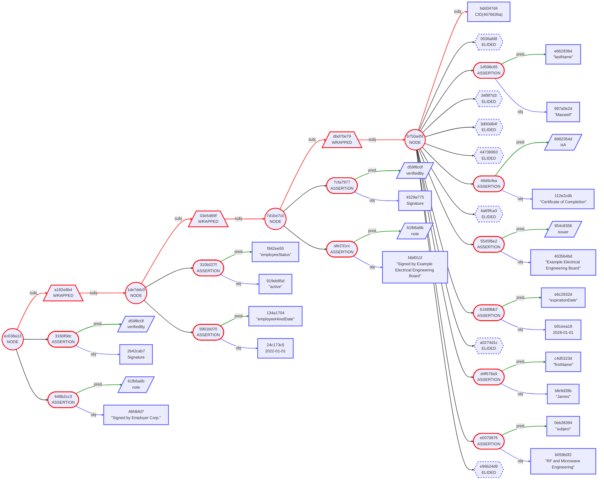
